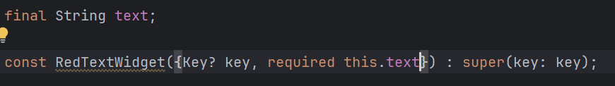

# Pertemuan 7: Manajemen Plugin

**NIM**: 2341720116
**Nama**: Hanif Faishal Hilmi

---

## 📌 Praktikum

### ✅ Praktikum Menerapkan Plugin di Project Flutter

* Langkah 1: Membuat Project Baru

* Langkah 2: Menambahkan Plugin

* Langkah 3: Buat file red_text_widget.dart

* Langkah 4: Tambah Widget AutoSizeText

Saat mengubah return Container menjadi AutoSizeText muncul pesan error karena variabel text belum didefinisikan.

* Langkah 5: Buat Variabel text dan parameter di constructor

* Langkah 6: Tambahkan widget di main.dart

[main.dart](lib/main.dart)

Run aplikasi

---

## 📌 Tugas Praktikum

1. Selesaikan Praktikum tersebut, lalu dokumentasikan dan push ke repository Anda berupa screenshot hasil pekerjaan beserta penjelasannya di file README.md!
2. Jelaskan maksud dari langkah 2 pada praktikum tersebut!

Langkah ke 2 adalah menambahkan plugin dari pub ke proyek flutter.

3. Jelaskan maksud dari langkah 5 pada praktikum tersebut!

Maksud dari langkah ini adalah jika menggunakan RedTextWidget, ia harus diberi sebuah nilai teks yang sifatnya tidak akan berubah.

4. Pada langkah 6 terdapat dua widget yang ditambahkan, jelaskan fungsi dan perbedaannya!

Ada perbedaan antara kedua widget ini. Widget pertama menggunakan widget custom bernama RedTextWidget. Di widget ini, sudah diatur ukuran, warna, baris maksimal, dan menggunakan plugin AutoSizeText. Untuk widget kedua, ia menggunakan bawaan flutter, lebih umum dipakai, dan lebih fleksibel.

Widget pertama digunakan untuk menghasilkan komponen yang konsisten dan reusability (bisa dipakai berkali-kali), sedangkan widget kedua digunakan untuk penggunaan tunggal (sekali pakai).

5. Jelaskan maksud dari tiap parameter yang ada di dalam plugin auto_size_text berdasarkan tautan pada dokumentasi ini !

* text : teks yang ingin ditampilkan
* style : memberikan gaya pada teks
* maxlines : menenentukan jumlah baris maksimum
* overflow : menangani teks jika melebihi batas

6. Kumpulkan laporan praktikum Anda berupa link repository GitHub kepada dosen!
